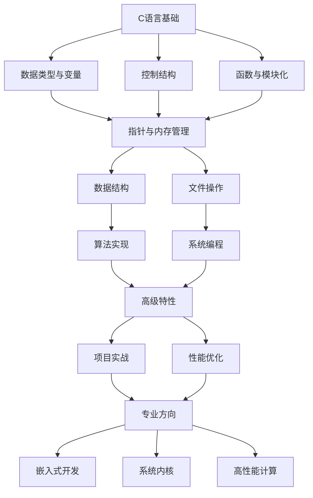

# C语言基础入门

## 学习目标

通过本章学习，你将掌握：
- C语言的基本概念和技术
- C语言的特点和应用领域
- 完整的开发环境搭建和配置
- 第一个C程序的编写、编译和运行
- C语言程序的编译过程和预处理机制
- C语言编程的最佳实践和安全编程原则

## 1. C语言概述

### 1.1 什么是C语言

C语言是一门面向过程的编译型语言，以其高效性和灵活性著称。作为系统编程语言的典型代表，C语言在操作系统、嵌入式系统、数据库管理系统等关键领域发挥着重要作用。

C语言的核心优势：
- **高性能**：编译后的代码执行效率接近汇编语言
- **系统级访问**：提供对硬件和系统资源的直接控制能力
- **广泛应用**：从微控制器到超级计算机都有C语言的身影
- **基础地位**：许多现代编程语言都受到C语言的影响

### 1.2 C语言的发展历史

C语言的发展历程体现了计算机科学的演进：

- **1972年**：Dennis Ritchie在贝尔实验室开发了C语言，用于重写UNIX操作系统
- **1978年**：《The C Programming Language》（K&R C）出版，确立了C语言的基础
- **1989年**：ANSI C（C89/C90）标准发布，成为第一个正式的C语言标准
- **1999年**：C99标准发布，引入了变长数组、复数类型、内联函数等新特性
- **2011年**：C11标准发布，增加了多线程支持、原子操作、泛型宏等
- **2018年**：C17标准发布，主要修复了C11中的缺陷和澄清
- **2023年**：C23标准发布，引入了更多现代化特性和安全改进

### 1.3 C语言的特点

C语言具有以下显著特点：

1. **简洁高效**：语法简洁明了，核心关键字仅32个，学习曲线相对平缓
2. **接近硬件**：提供位操作、指针操作等底层编程能力
3. **可移植性强**：标准C程序可以在不同平台间移植，只需重新编译
4. **功能强大**：既适合系统编程，也可用于应用程序开发
5. **编译型语言**：源代码编译为机器码，运行时无需解释器
6. **结构化编程**：支持函数、模块化设计，程序结构清晰

## 2. 开发环境搭建

### 2.1 编译器选择

现代C语言开发主要使用以下编译器：

| 编译器 | 平台 | 特点 | 推荐用途 |
|--------|------|------|----------|
| GCC | Linux/Windows/macOS | 开源、标准兼容性好 | 通用开发 |
| Clang | Linux/Windows/macOS | 错误信息友好、编译速度快 | 现代C开发 |
| MSVC | Windows | 与Windows平台集成度高 | Windows专用开发 |

### 2.2 Windows环境配置

#### 2.2.1 安装MinGW-w64

1. 下载MSYS2安装包：https://www.msys2.org/
2. 安装完成后，打开MSYS2终端
3. 更新包管理器：
   ```bash
   pacman -Syu
   ```
4. 安装开发工具链：
   ```bash
   pacman -S mingw-w64-x86_64-gcc
   pacman -S mingw-w64-x86_64-gdb
   pacman -S mingw-w64-x86_64-make
   ```
5. 将`C:\msys64\mingw64\bin`添加到系统PATH环境变量

#### 2.2.2 验证安装

```bash
gcc --version
gdb --version
```

### 2.3 Linux环境配置

#### Ubuntu/Debian系统：
```bash
sudo apt update
sudo apt install build-essential gdb
```

#### CentOS/RHEL系统：
```bash
sudo yum groupinstall "Development Tools"
sudo yum install gdb
```

### 2.4 macOS环境配置

#### 使用Xcode Command Line Tools：
```bash
xcode-select --install
```

#### 使用Homebrew安装GCC：
```bash
brew install gcc
```

### 2.5 VS Code开发环境配置

#### 2.5.1 安装必要扩展

1. **C/C++扩展**：提供语法高亮、智能提示、调试支持
2. **Code Runner**：快速运行代码片段
3. **C/C++ Themes**：专门的语法高亮主题

#### 2.5.2 配置文件设置

创建`.vscode`文件夹，包含以下配置文件：

**tasks.json**（编译任务配置）：
```json
{
    "version": "2.0.0",
    "tasks": [
        {
            "label": "build",
            "type": "shell",
            "command": "gcc",
            "args": [
                "-Wall",
                "-Wextra",
                "-std=c99",
                "-g",
                "${file}",
                "-o",
                "${fileDirname}/${fileBasenameNoExtension}"
            ],
            "group": {
                "kind": "build",
                "isDefault": true
            },
            "presentation": {
                "echo": true,
                "reveal": "always",
                "focus": false,
                "panel": "shared"
            },
            "problemMatcher": ["$gcc"]
        }
    ]
}
```

**launch.json**（调试配置）：
```json
{
    "version": "0.2.0",
    "configurations": [
        {
            "name": "Debug C Program",
            "type": "cppdbg",
            "request": "launch",
            "program": "${fileDirname}/${fileBasenameNoExtension}",
            "args": [],
            "stopAtEntry": false,
            "cwd": "${fileDirname}",
            "environment": [],
            "externalConsole": false,
            "MIMode": "gdb",
            "miDebuggerPath": "gdb",
            "setupCommands": [
                {
                    "description": "Enable pretty-printing for gdb",
                    "text": "-enable-pretty-printing",
                    "ignoreFailures": true
                }
            ],
            "preLaunchTask": "build"
        }
    ]
}
```

**c_cpp_properties.json**（IntelliSense配置）：
```json
{
    "configurations": [
        {
            "name": "Win32",
            "includePath": [
                "${workspaceFolder}/**",
                "C:/msys64/mingw64/include/**"
            ],
            "defines": [
                "_DEBUG",
                "UNICODE",
                "_UNICODE"
            ],
            "compilerPath": "C:/msys64/mingw64/bin/gcc.exe",
            "cStandard": "c99",
            "intelliSenseMode": "gcc-x64"
        }
    ],
    "version": 4
}
```

### 2.6 其他推荐IDE

- **CLion**：JetBrains出品，功能强大但需付费
- **Dev-C++**：轻量级，适合初学者
- **Code::Blocks**：跨平台，免费开源
- **Qt Creator**：适合GUI应用开发

## 3. 第一个C程序

### 3.1 Hello World程序

```c
#include <stdio.h>

int main(void) {
    printf("Hello, World!\n");
    return 0;
}
```

### 3.2 程序结构分析

```c
#include <stdio.h>    // 预处理指令：包含标准输入输出库

int main(void) {      // 主函数定义
    // 函数体开始
    printf("Hello, World!\n");  // 输出语句
    return 0;         // 返回状态码，0表示成功
}                     // 函数体结束
```

### 3.3 编译和运行

#### 基本编译：
```bash
gcc hello.c -o hello
./hello                # Linux/macOS
hello.exe             # Windows
```

#### 带调试信息的编译：
```bash
gcc -g -Wall -Wextra -std=c99 hello.c -o hello
```

#### 编译选项说明：
- `-g`：生成调试信息
- `-Wall`：启用常见警告
- `-Wextra`：启用额外警告
- `-std=c99`：使用C99标准
- `-O2`：优化级别2（发布版本）

## 4. 编译过程详解

### 4.1 编译四阶段

C语言程序的编译过程包含四个主要阶段：

```
源文件(.c) → 预处理 → 编译 → 汇编 → 链接 → 可执行文件
```

#### 4.1.1 预处理阶段
```bash
gcc -E hello.c -o hello.i
```
- 处理`#include`指令，插入头文件内容
- 处理`#define`宏定义，进行文本替换
- 处理条件编译指令（`#ifdef`、`#ifndef`等）
- 删除注释

#### 4.1.2 编译阶段
```bash
gcc -S hello.i -o hello.s
```
- 将预处理后的代码转换为汇编语言
- 进行语法分析和语义分析
- 执行代码优化

#### 4.1.3 汇编阶段
```bash
gcc -c hello.s -o hello.o
```
- 将汇编代码转换为机器码
- 生成目标文件（.o或.obj）

#### 4.1.4 链接阶段
```bash
gcc hello.o -o hello
```
- 将目标文件与库文件链接
- 解析外部符号引用
- 生成最终的可执行文件

### 4.2 常用编译选项

```bash
# 开发阶段推荐选项
gcc -Wall -Wextra -Wpedantic -std=c99 -g -O0 source.c -o program

# 发布版本推荐选项
gcc -Wall -Wextra -std=c99 -O2 -DNDEBUG source.c -o program
```

### 4.3 库文件链接

#### 链接数学库：
```bash
gcc program.c -lm -o program
```

#### 链接多个库：
```bash
gcc program.c -lm -lpthread -lcurl -o program
```

#### 指定库搜索路径：
```bash
gcc program.c -L/usr/local/lib -lmylib -o program
```

## 5. 预处理器详解

### 5.1 文件包含

```c
#include <stdio.h>     // 系统头文件，使用尖括号
#include "myheader.h"  // 用户头文件，使用双引号
```

### 5.2 宏定义

```c
#define PI 3.14159265359
#define MAX(a, b) ((a) > (b) ? (a) : (b))
#define SQUARE(x) ((x) * (x))

// 多行宏定义
#define SWAP(a, b) do { \
    typeof(a) temp = (a); \
    (a) = (b); \
    (b) = temp; \
} while(0)
```

### 5.3 条件编译

```c
#ifdef DEBUG
    #define DBG_PRINT(fmt, ...) printf(fmt, ##__VA_ARGS__)
#else
    #define DBG_PRINT(fmt, ...) ((void)0)
#endif

#ifndef CONFIG_H
#define CONFIG_H
// 头文件保护
#endif

// 平台相关编译
#ifdef _WIN32
    #include <windows.h>
#elif defined(__linux__)
    #include <unistd.h>
#elif defined(__APPLE__)
    #include <sys/types.h>
#endif
```

### 5.4 预定义宏

```c
#include <stdio.h>

void print_compile_info(void) {
    printf("文件: %s\n", __FILE__);
    printf("行号: %d\n", __LINE__);
    printf("函数: %s\n", __func__);
    printf("编译日期: %s\n", __DATE__);
    printf("编译时间: %s\n", __TIME__);
    printf("C标准: %ld\n", __STDC_VERSION__);
}
```

## 6. 项目组织与构建

### 6.1 推荐项目结构

```
project/
├── src/              # 源代码文件
│   ├── main.c
│   ├── utils.c
│   └── math_ops.c
├── include/          # 头文件
│   ├── utils.h
│   └── math_ops.h
├── tests/            # 测试文件
│   ├── test_utils.c
│   └── test_math.c
├── docs/             # 文档
├── build/            # 构建输出
├── Makefile          # 构建脚本
├── README.md         # 项目说明
└── .gitignore        # Git忽略文件
```

### 6.2 简单Makefile示例

```makefile
CC = gcc
CFLAGS = -Wall -Wextra -std=c99 -g
SRCDIR = src
INCDIR = include
BUILDDIR = build

SOURCES = $(wildcard $(SRCDIR)/*.c)
OBJECTS = $(SOURCES:$(SRCDIR)/%.c=$(BUILDDIR)/%.o)
TARGET = $(BUILDDIR)/program

.PHONY: all clean

all: $(TARGET)

$(TARGET): $(OBJECTS) | $(BUILDDIR)
	$(CC) $(OBJECTS) -o $@

$(BUILDDIR)/%.o: $(SRCDIR)/%.c | $(BUILDDIR)
	$(CC) $(CFLAGS) -I$(INCDIR) -c $< -o $@

$(BUILDDIR):
	mkdir -p $(BUILDDIR)

clean:
	rm -rf $(BUILDDIR)

install: $(TARGET)
	cp $(TARGET) /usr/local/bin/

.PHONY: test
test: $(TARGET)
	./$(TARGET)
```

## 7. 最佳实践与安全编程

### 7.1 代码风格规范

```c
#include <stdio.h>
#include <stdlib.h>
#include <stdint.h>

// 使用有意义的函数名和变量名
int calculate_factorial(int number) {
    // 输入验证
    if (number < 0) {
        return -1;  // 错误码
    }
    
    int result = 1;
    for (int i = 1; i <= number; i++) {
        result *= i;
    }
    
    return result;
}

// 使用固定宽度类型提高可移植性
void process_data(uint32_t *data, size_t count) {
    if (data == NULL || count == 0) {
        return;  // 防御性编程
    }
    
    for (size_t i = 0; i < count; i++) {
        data[i] = data[i] * 2;
    }
}
```

### 7.2 内存管理最佳实践

```c
#include <stdlib.h>
#include <string.h>

// 安全的内存分配函数
void* safe_malloc(size_t size) {
    void *ptr = malloc(size);
    if (ptr == NULL) {
        fprintf(stderr, "内存分配失败\n");
        exit(EXIT_FAILURE);
    }
    return ptr;
}

// 安全的字符串复制
char* safe_strdup(const char *src) {
    if (src == NULL) {
        return NULL;
    }
    
    size_t len = strlen(src) + 1;
    char *dst = safe_malloc(len);
    memcpy(dst, src, len);
    
    return dst;
}

// 内存管理示例
void memory_management_example(void) {
    // 分配内存
    int *numbers = safe_malloc(10 * sizeof(int));
    
    // 初始化数据
    for (int i = 0; i < 10; i++) {
        numbers[i] = i * i;
    }
    
    // 使用数据
    for (int i = 0; i < 10; i++) {
        printf("%d ", numbers[i]);
    }
    printf("\n");
    
    // 释放内存
    free(numbers);
    numbers = NULL;  // 避免悬空指针
}
```

### 7.3 错误处理策略

```c
#include <errno.h>
#include <string.h>

// 文件操作错误处理
int read_file_safely(const char *filename, char *buffer, size_t buffer_size) {
    FILE *file = fopen(filename, "r");
    if (file == NULL) {
        fprintf(stderr, "无法打开文件 %s: %s\n", 
                filename, strerror(errno));
        return -1;
    }
    
    size_t bytes_read = fread(buffer, 1, buffer_size - 1, file);
    if (ferror(file)) {
        fprintf(stderr, "读取文件时发生错误: %s\n", strerror(errno));
        fclose(file);
        return -1;
    }
    
    buffer[bytes_read] = '\0';  // 确保字符串终止
    fclose(file);
    return (int)bytes_read;
}
```

### 7.4 调试技巧

```c
#include <assert.h>

// 调试宏定义
#ifdef DEBUG
    #define DEBUG_PRINT(fmt, ...) \
        fprintf(stderr, "[DEBUG] %s:%d:%s() " fmt "\n", __FILE__, __LINE__, __func__, ##__VA_ARGS__)
#else
    #define DEBUG_PRINT(fmt, ...)
#endif

// 使用断言进行调试
void array_process(int *arr, size_t size) {
    assert(arr != NULL);    // 确保指针有效
    assert(size > 0);       // 确保数组非空
    
    DEBUG_PRINT("处理数组，大小: %zu", size);
    
    for (size_t i = 0; i < size; i++) {
        arr[i] *= 2;
        DEBUG_PRINT("arr[%zu] = %d", i, arr[i]);
    }
}
```

## 8. 学习路径与总结

### 8.1 C语言学习路线图



### 8.2 核心知识点掌握检查表

#### 基础语法 ✓
- [ ] 变量声明与初始化
- [ ] 数据类型转换
- [ ] 运算符优先级
- [ ] 控制流语句
- [ ] 函数定义与调用

#### 内存管理 ✓
- [ ] 指针概念与操作
- [ ] 动态内存分配
- [ ] 内存泄漏预防
- [ ] 缓冲区溢出防护
- [ ] 智能指针模拟

#### 高级特性 ✓
- [ ] 结构体与联合体
- [ ] 函数指针
- [ ] 预处理器宏
- [ ] 多文件编程
- [ ] 库的创建与使用

#### 系统编程 ✓
- [ ] 文件I/O操作
- [ ] 进程间通信
- [ ] 网络编程基础
- [ ] 多线程编程
- [ ] 信号处理

### 8.3 实践项目建议

| 难度级别 | 项目类型 | 具体项目 | 核心技能 |
|----------|----------|----------|----------|
| **初级** | 控制台应用 | 计算器、文本编辑器 | 基础语法、文件操作 |
| **中级** | 数据结构 | 链表、栈、队列、哈希表 | 指针、内存管理 |
| **中高级** | 系统工具 | 文件管理器、网络客户端 | 系统调用、网络编程 |
| **高级** | 底层系统 | 简单操作系统内核、编译器 | 汇编、系统架构 |

### 8.4 学习资源推荐

#### 经典书籍
1. **《C程序设计语言》** - Kernighan & Ritchie
   - C语言创始人编写，权威性最高
   - 适合有编程基础的学习者

2. **《C和指针》** - Kenneth Reek
   - 深入讲解指针概念
   - 大量实例和练习

3. **《C陷阱与缺陷》** - Andrew Koenig
   - 常见错误与避免方法
   - 提高代码质量必读

#### 在线资源
- **C Reference**: https://en.cppreference.com/w/c
- **GCC文档**: https://gcc.gnu.org/onlinedocs/
- **Linux系统调用**: https://man7.org/linux/man-pages/

#### 实践平台
- **LeetCode**: 算法练习
- **HackerRank**: 编程挑战
- **GitHub**: 开源项目参与

### 8.5 职业发展方向

```c
// career_paths.c - C语言职业发展路径
#include <stdio.h>

typedef enum {
    EMBEDDED_ENGINEER,      // 嵌入式工程师
    SYSTEM_PROGRAMMER,      // 系统程序员
    KERNEL_DEVELOPER,       // 内核开发者
    HPC_ENGINEER,          // 高性能计算工程师
    SECURITY_RESEARCHER,    // 安全研究员
    COMPILER_DEVELOPER     // 编译器开发者
} career_path_t;

typedef struct {
    career_path_t path;
    const char *description;
    const char *key_skills;
    const char *typical_projects;
} career_info_t;

static const career_info_t career_paths[] = {
    {
        .path = EMBEDDED_ENGINEER,
        .description = "开发嵌入式系统和IoT设备",
        .key_skills = "微控制器编程、实时系统、硬件接口",
        .typical_projects = "智能家居、汽车电子、工业控制"
    },
    {
        .path = SYSTEM_PROGRAMMER,
        .description = "开发系统级软件和工具",
        .key_skills = "操作系统原理、网络编程、并发控制",
        .typical_projects = "数据库系统、网络服务器、系统工具"
    },
    {
        .path = KERNEL_DEVELOPER,
        .description = "参与操作系统内核开发",
        .key_skills = "内核架构、设备驱动、内存管理",
        .typical_projects = "Linux内核、设备驱动、虚拟化"
    },
    {
        .path = HPC_ENGINEER,
        .description = "高性能计算和科学计算",
        .key_skills = "并行计算、算法优化、数值计算",
        .typical_projects = "超级计算机、科学模拟、机器学习"
    }
};

void print_career_info(career_path_t path) {
    const career_info_t *info = &career_paths[path];
    printf("职业方向: %s\n", info->description);
    printf("核心技能: %s\n", info->key_skills);
    printf("典型项目: %s\n", info->typical_projects);
    printf("\n");
}
```

### 8.6 持续学习建议

#### 技术深度
1. **深入理解计算机系统** - 学习计算机体系结构
2. **操作系统原理** - 理解系统调用和内核机制
3. **网络编程** - 掌握TCP/IP协议栈
4. **并发编程** - 多线程和异步编程

#### 工程实践
1. **版本控制** - 熟练使用Git
2. **构建系统** - 掌握Make、CMake等工具
3. **调试技能** - 使用GDB、Valgrind等工具
4. **性能分析** - 学习性能测试和优化

#### 软技能
1. **代码审查** - 参与开源项目
2. **技术写作** - 记录学习心得
3. **团队协作** - 参与团队项目
4. **持续学习** - 跟上技术发展趋势

## 9. 总结

通过本章的学习，你已经建立了C语言的完整知识框架：

### 9.1 核心收获

1. **语言理解**：深入理解C语言的设计理念和核心特性
2. **环境搭建**：掌握现代化的开发环境配置
3. **编译系统**：理解从源码到可执行文件的完整流程
4. **安全编程**：学会编写安全、可靠的C代码
5. **工程实践**：掌握项目组织和构建系统

### 9.2 下一步学习重点

1. **深入指针和内存管理** - C语言的核心概念
2. **数据结构实现** - 提升编程能力的关键
3. **系统编程接口** - 连接应用与操作系统
4. **性能优化技术** - 发挥C语言的性能优势

### 9.3 学习心态

C语言学习是一个渐进的过程，需要：
- **耐心实践**：通过大量编程练习巩固概念
- **深入思考**：理解底层原理而非仅仅记忆语法
- **持续改进**：不断重构和优化代码质量
- **开放心态**：积极参与社区交流和项目协作

记住，C语言不仅是一门编程语言，更是理解计算机系统的重要工具。掌握C语言将为你的编程生涯奠定坚实的基础，无论你将来选择哪个技术方向，这些知识都将是宝贵的财富。

**开始你的C语言之旅吧！每一行代码都是向着成为优秀程序员迈出的坚实一步。**
